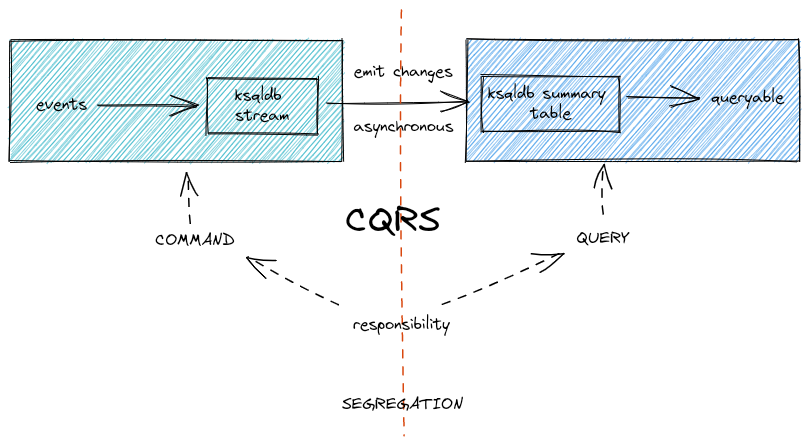
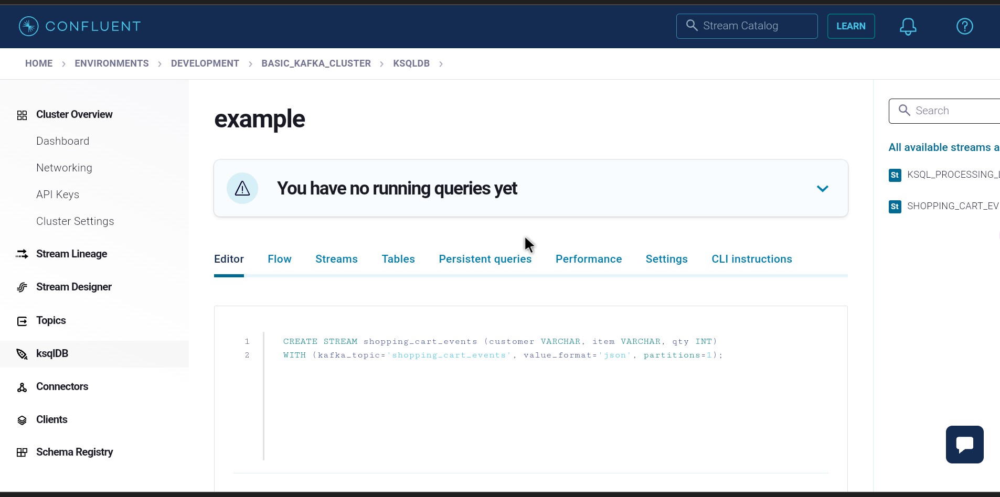
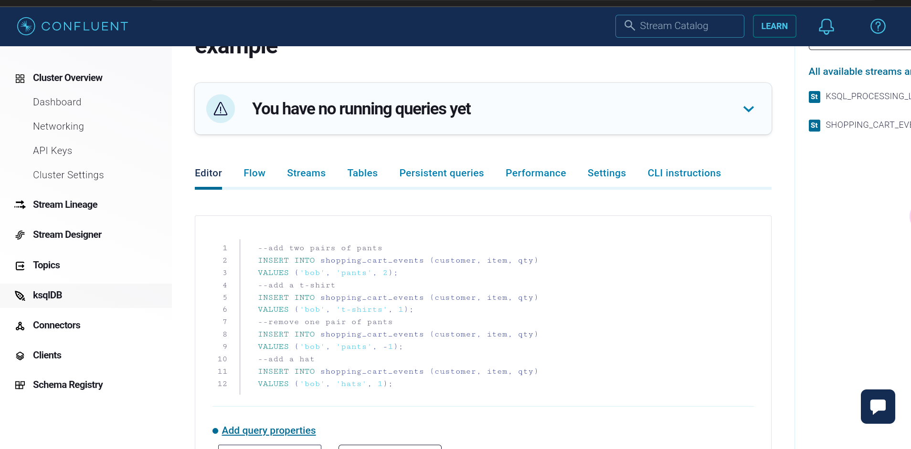
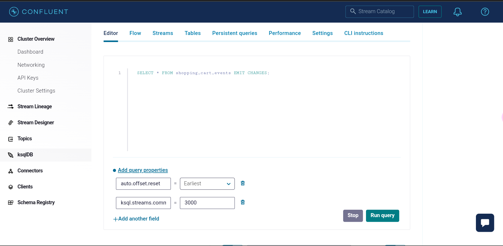
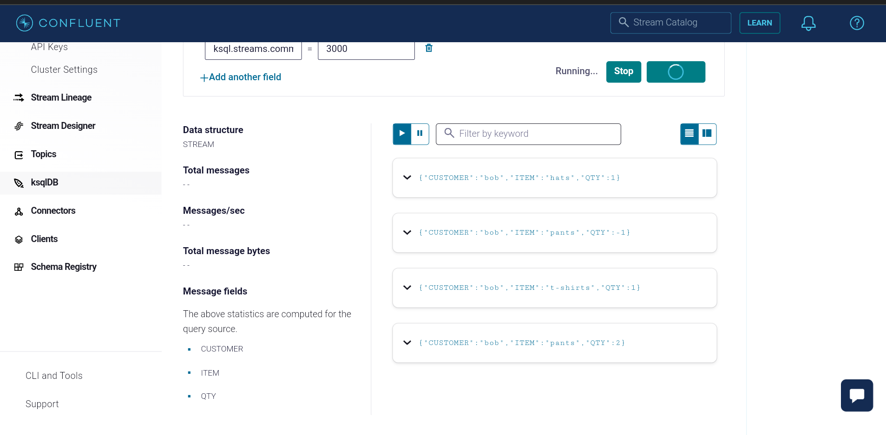
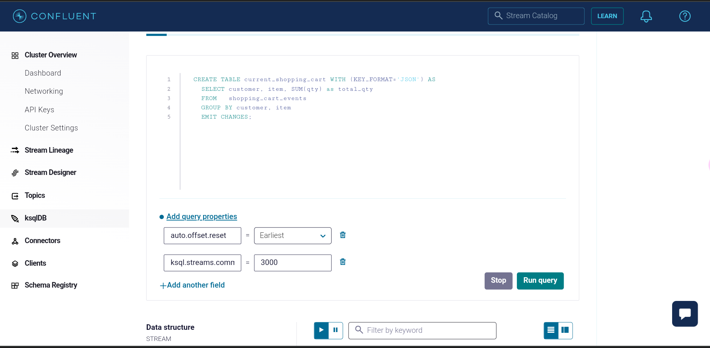
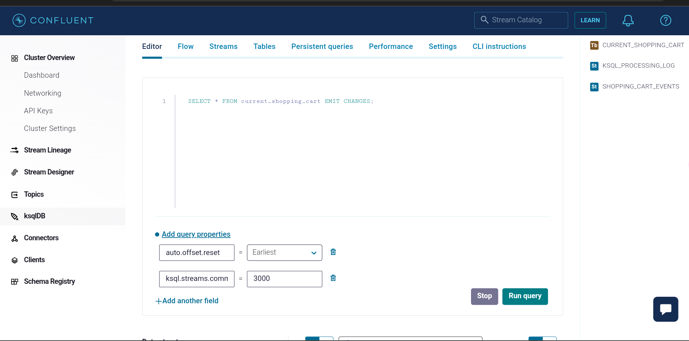
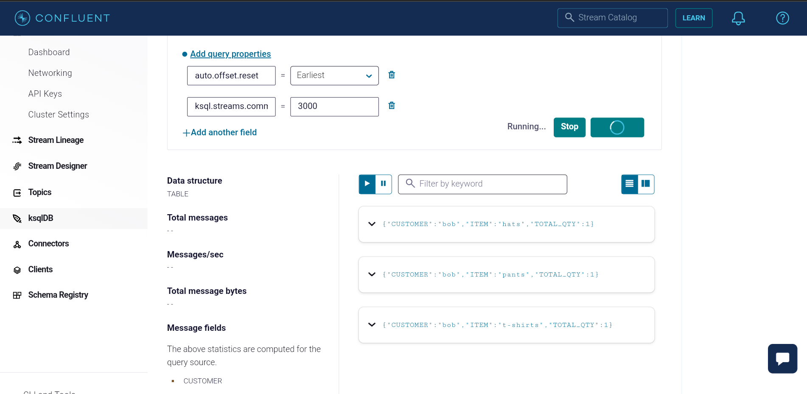

# confluent-event-sourcing

Event Sourcing based on CQRS Architecture:


To test the queries for KSQLDB, feel free to use terraform resources from below repo to get started quickly:
[Confluent Terraform Deploy](https://github.com/Satej/confluent-kafka-terraform)

1. In the KSQLDB interface, make sure to have below two properties.

`auto.offset.reset = Earliest`
`ksql.streams.commit.interval.ms = 3000`

2. Create stream to hold shopping cart events.

```sql
CREATE STREAM shopping_cart_events (customer VARCHAR, item VARCHAR, qty INT)
WITH (kafka_topic='shopping_cart_events', value_format='json', partitions=1);
```



3. Insert a few shopping cart events.

```sql
--add two pairs of pants
INSERT INTO shopping_cart_events (customer, item, qty)
VALUES ('bob', 'pants', 2);
--add a t-shirt
INSERT INTO shopping_cart_events (customer, item, qty)
VALUES ('bob', 't-shirts', 1);
--remove one pair of pants
INSERT INTO shopping_cart_events (customer, item, qty)
VALUES ('bob', 'pants', -1);
--add a hat
INSERT INTO shopping_cart_events (customer, item, qty)
VALUES ('bob', 'hats', 1);
```


4. Search for inserted shopping cart events.

```sql
SELECT * FROM shopping_cart_events EMIT CHANGES;
```





5. Create summary table in KSQLDB to transform inserted events through aggregation.

```sql
CREATE TABLE current_shopping_cart WITH (KEY_FORMAT='JSON') AS
  SELECT customer, item, SUM(qty) as total_qty 
  FROM   shopping_cart_events 
  GROUP BY customer, item 
  EMIT CHANGES;
```



6. Search for summarized events.

```sql
SELECT * FROM current_shopping_cart EMIT CHANGES;
```




